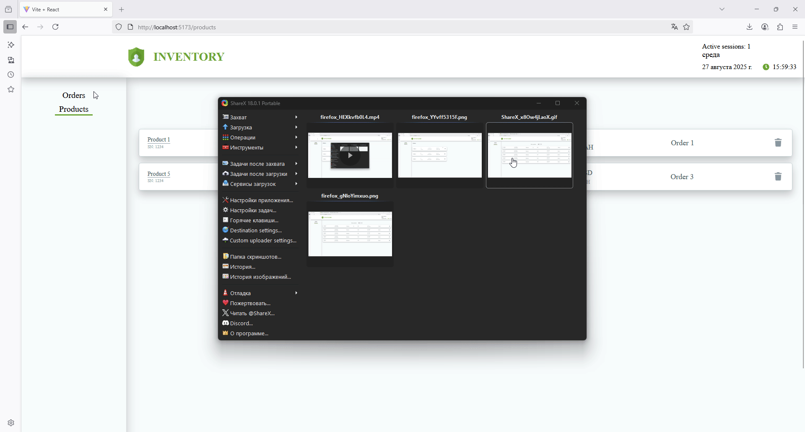

# Test React App

 

## Description

This is a test application built with **React** featuring:

- **React Router** — for page navigation
- **Redux / Redux Toolkit** — for state management
- **Functionality**:
  - View a list of orders
  - View products inside each order
  - Sorting of orders and products
  - Deleting products and orders

The app demonstrates basic React and Redux capabilities and can be extended for learning or testing purposes.

---


### 🔧 launch in Docker
```bash
git clone https://github.com/Vermin84/dzenTestFinal.git
cd project-name
docker-compose up --build
